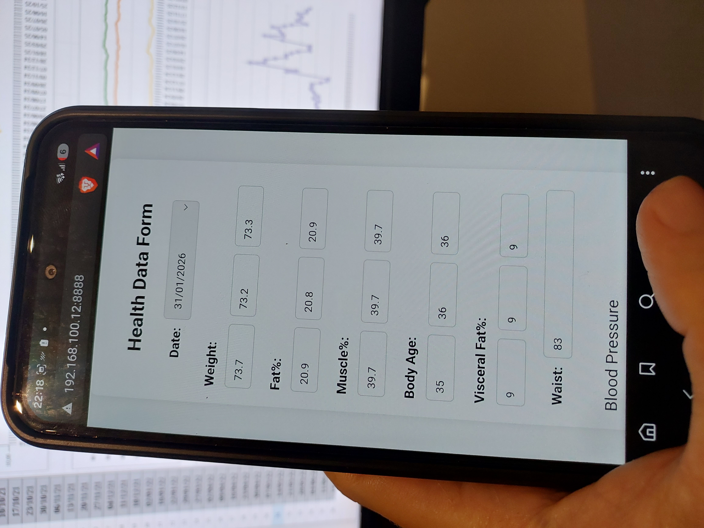
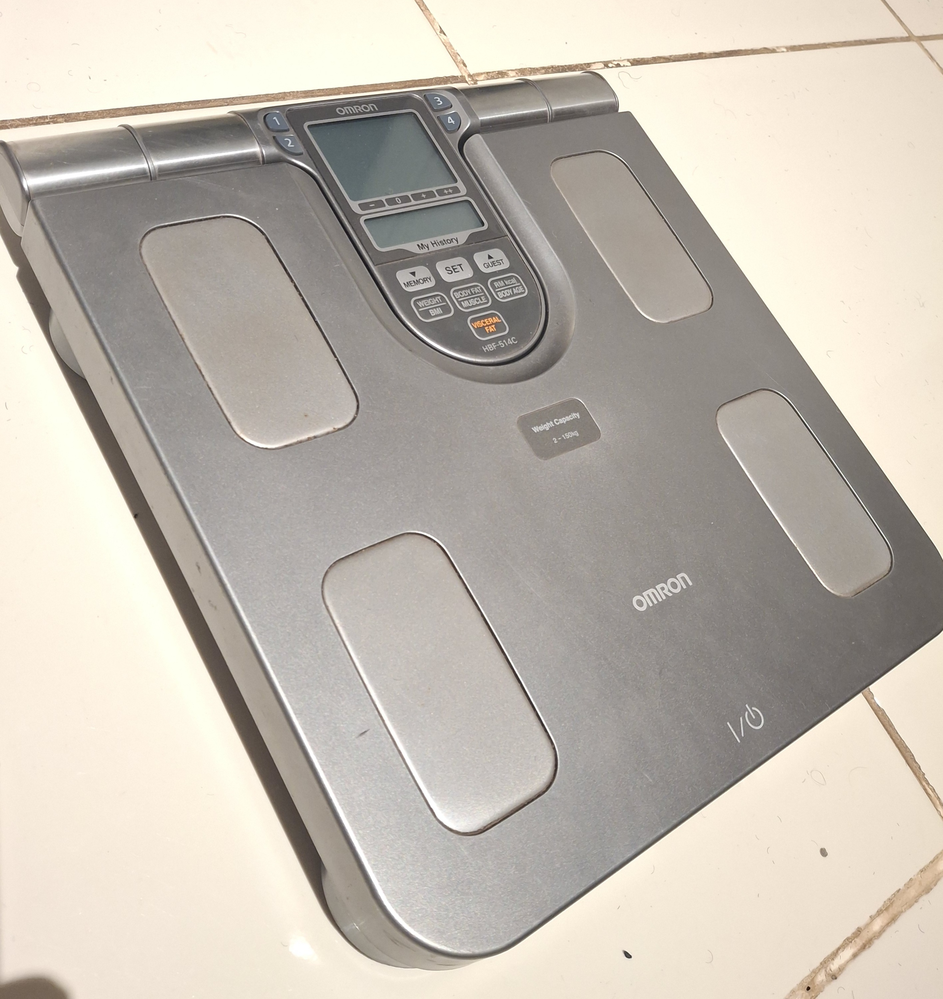
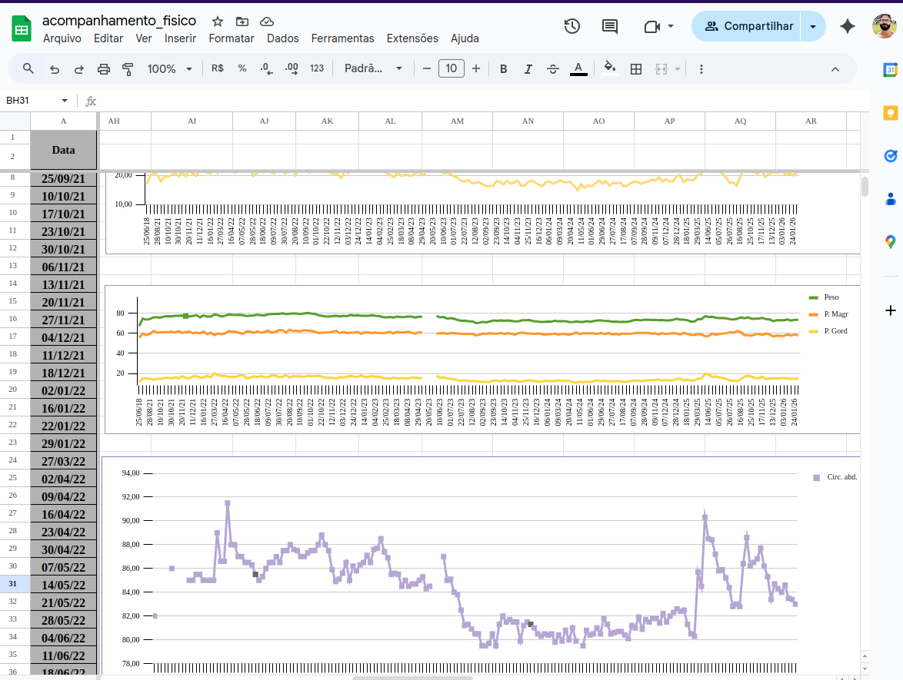
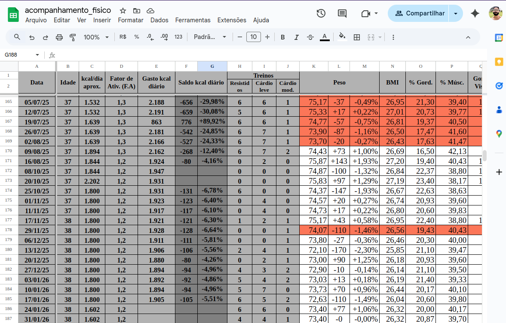
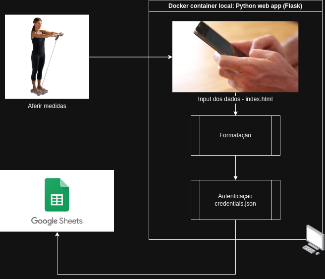

# Fitness Data Integrator

Uma solução para melhor coletar, transformar e persistir dados de peso, percentual de gordura, músculo e outros direto da minha velha balança de bioimpendância _Omron HBF-415C_ (que não é _smart_) para a nuvem do Google.

  
  

A planilha (Google Sheets) já era usada há muito tempo, mas o trabalho tedioso e _error-prone_ de anotar, copiar e colar à mão todas as mais de 20 informações de cada sessão de medição é significativamente reduzido.

Ao invés de anotá-las em rascunhos intermediários, agora é possível inseri-las diretamente no web app via browser, clicar em Send e salvá-las já formatadas na nuvem do Google, atualizando estatísticas e gráficos automaticamente.

  

